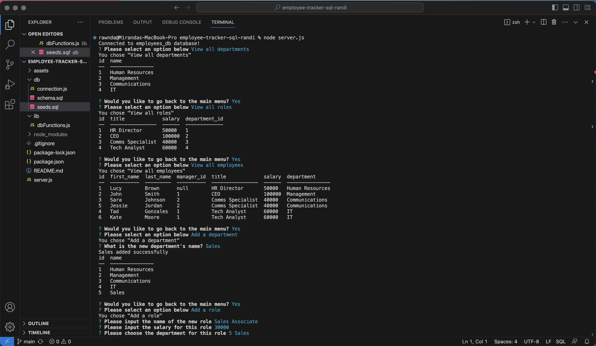
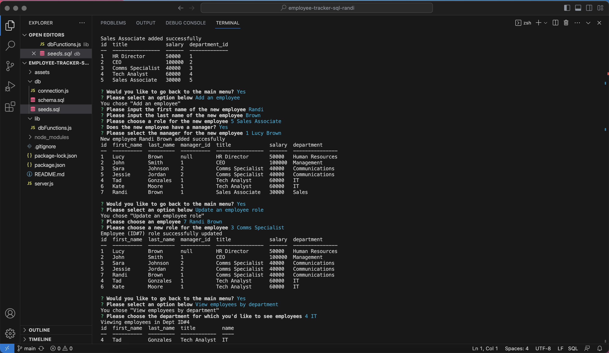
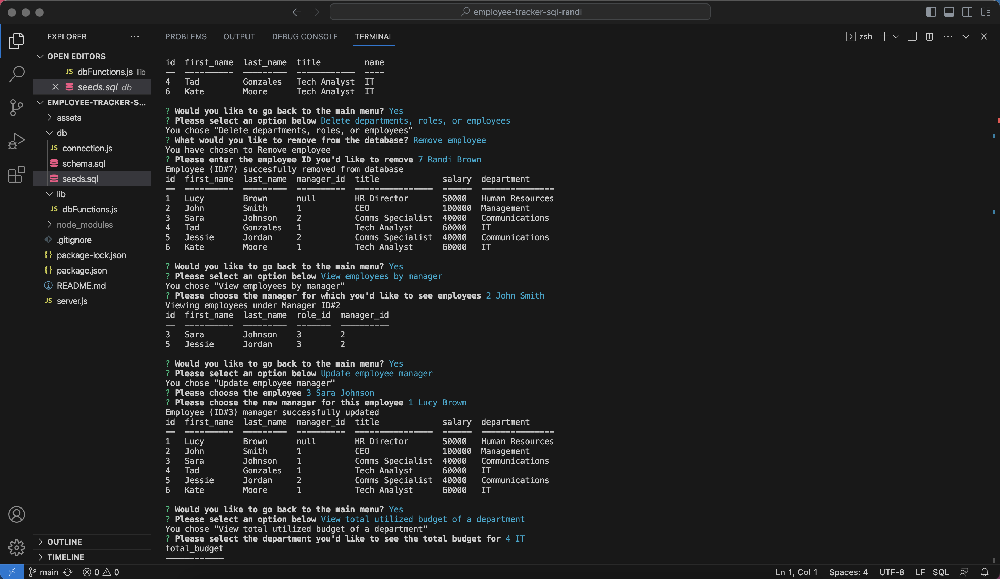
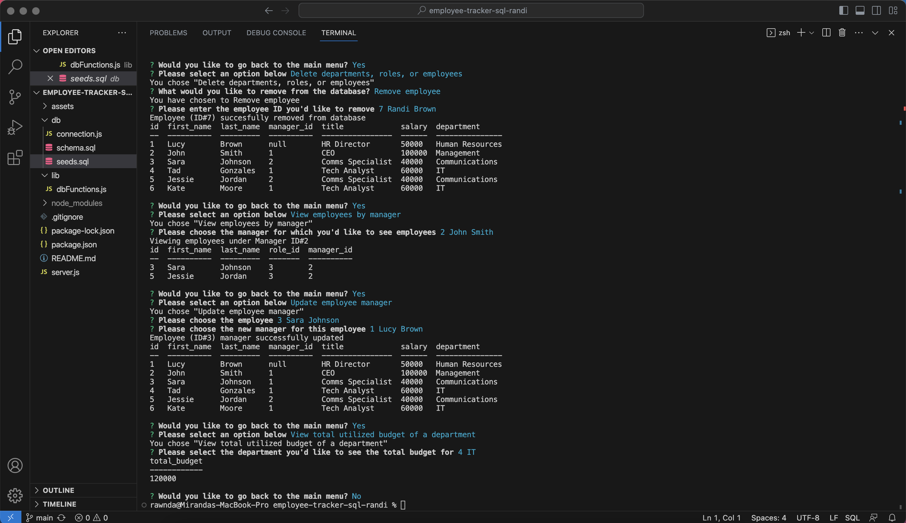

# Employee Tracker - SQL & Inquirer (Module 12 Challenge)

## Description

This app is a simple, yet effective content management system (CMS) that allows non-developers to easily view and interact with employee information stored in an SQL database.  

This CMS uses `MySQL2` and `Inquirer` to prompt users with tasks relating to their employee database, and return easy-to-understand tables with the corresponding results.  

## Table of Contents

- [User Story](#user-story)
- [Acceptance Criteria](#acceptance-criteria)
- [Installation](#installation)
- [Usage](#usage)
- [Credits](#credits)
- [Features](#features)

## User Story

AS A business owner  
I WANT to be able to view and manage the departments, roles, and employees in my company  
SO THAT I can organize and plan my business

## Acceptance Criteria

GIVEN a command-line application that accepts user input  
WHEN I start the application  
THEN I am presented with the following options: view all departments, view all roles, view all employees, add a department, add a role, add an employee, and update an employee role  
WHEN I choose to view all departments  
THEN I am presented with a formatted table showing department names and department ids  
WHEN I choose to view all roles  
THEN I am presented with the job title, role id, the department that role belongs to, and the salary for that role  
WHEN I choose to view all employees  
THEN I am presented with a formatted table showing employee data, including employee ids, first names, last names, job titles, departments, salaries, and managers that the employees report to  
WHEN I choose to add a department  
THEN I am prompted to enter the name of the department and that department is added to the database  
WHEN I choose to add a role  
THEN I am prompted to enter the name, salary, and department for the role and that role is added to the database  
WHEN I choose to add an employee  
THEN I am prompted to enter the employee’s first name, last name, role, and manager, and that employee is added to the database  
WHEN I choose to update an employee role  
THEN I am prompted to select an employee to update and their new role and this information is updated in the database  

## Installation

Here are the steps to install this app:  

- Make sure `Node.js` and `MySQL` is installed on your local machine  
- Clone the repo here: https://github.com/randirose/employee-tracker-sql-randi  
- Run `npm install` to install all dependencies from `package.json`

## Usage

Follow these instructions to use this app:  

- If using for an actual employee database, edit `schema.sql` and `seeds.sql` in the `db` folder to match what you'd like your database to look like  
- Source these files to create the blueprint and initial values in your database using the `MySQL Shell`  
- In your CLI, run `node server.js` to invoke the application  
- See screenshots and the walk-through video below for demonstrations on the app's functionality  

Link to walk-through video on Google Drive: https://drive.google.com/file/d/13qWAnPmMMWDP9TOsOC_cRwSkIp1M9VNi/view   

https://github.com/randirose/employee-tracker-sql-randi/assets/128757891/0cdfee0a-2ce7-4cdf-8201-b9a26725a98a  

  
  
  

## Credits

AskBCS Learning Assistant on Slack: helped with correctly importing and exporting `connection.js` and `dbFunctions.js` as to not throw any errors.  

## Features

This app / CMS has the following features:  
- View all departments: view all departments in your database
- View all roles: view all roles in your database
- View all employees: view all employees in your database
- Add a department: add a department to your database
- Add a role: add a role to your database
- Add an employee: add an employee to your database
- Update an employee role: update an employee role in your database  
**BONUS FEATURES**
- View employees by department: select a department and view all employees assigned to that department
- Delete departments, roles, or employees: delete a department, role or employee
- View employees by manager: select an employee(manager) and view all employees under that manager
- Update employee manager: update an employee's manager
- View total utilized budget of a department: view the sum of all active salaries within a department

In addition, this app allows an easy flow with the following features:  
- Restart functions to prompt the user for their desired next action after fulfilling one request
- Listing of departments, roles, and/or employees where applicable within the Inquirer prompts, so the user doesn't have to know IDs/names when selecting their choices
